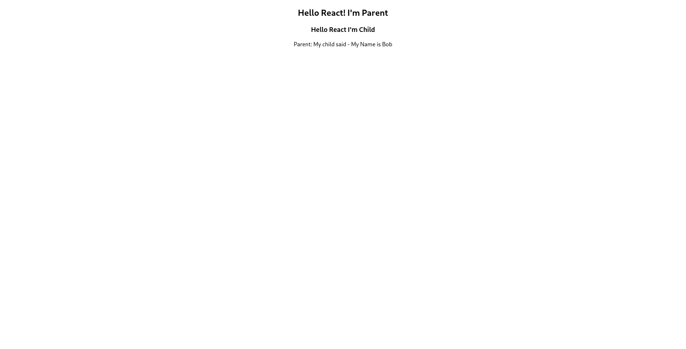

# React Practical Day 07: Parent-Child Communication

This React project demonstrates how to pass data from a parent component to a child component and how to update the parent component's state from the child component.

### How it works
- The parent component `App` has a state object with a property `childName` and the function `receiveName` to call the set state method.
- The parent component `App` passes the function `receiveName` to the child component `ChildComp`.
- `ChildComp` sets the `childName` property by calling the `receiveName` function.

### Output
